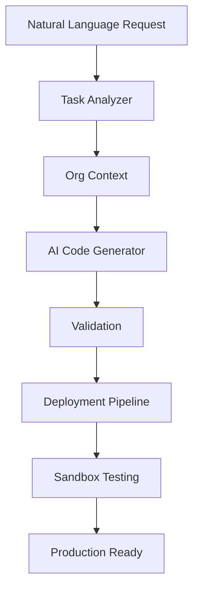

# Autonomous Salesforce Development System

## 🚀 Overview

An AI-powered autonomous development system that transforms natural language requests into deployable Salesforce code. Built with Claude Agent SDK and official Salesforce SDKs, this system enables rapid development, testing, and deployment of Salesforce customizations.

## ✨ Features

- **Natural Language Processing**: Describe what you want in plain English
- **Autonomous Code Generation**: AI generates Apex, LWC, Flows, and metadata
- **Automated Testing**: Generates test classes with >75% coverage
- **Smart Deployment**: Deploys to sandbox with automatic validation
- **Risk Assessment**: Analyzes and scores changes for safety
- **Self-Learning**: Adapts to your org's structure and patterns

## 🛠️ Technology Stack

- **AI**: Claude Agent SDK (Anthropic)
- **Runtime**: Node.js 18+
- **Salesforce**: JSforce, Salesforce CLI
- **Platform**: Windows (cross-platform compatible)

## 📋 Prerequisites

- Node.js 18+ and npm
- Salesforce org with API access
- Claude API key
- Windows OS (for initial deployment)

## ⚡ Quick Start

### 1. Clone and Setup

```bash
git clone https://github.com/DevinBristol/salesforce-org-analysis.git
cd salesforce-org-analysis
```

### 2. Run Windows Setup (PowerShell as Administrator)

```powershell
.\setup.ps1
```

### 3. Configure Environment

Edit `.env` file with your credentials:

```env
CLAUDE_API_KEY=your_claude_api_key
SF_USERNAME=your_salesforce_username@example.com
SF_LOGIN_URL=https://login.salesforce.com
```

### 4. Authenticate to Salesforce

```bash
# Production org (for metadata)
sf org login web --alias production --instance-url https://login.salesforce.com

# Developer sandbox (for testing)
sf org login web --alias dev-sandbox --instance-url https://test.salesforce.com
```

### 5. Initialize System

```bash
npm run init-system
```

### 6. Start the System

```bash
npm run start
```

## 🎯 Usage

### Submit a Development Task

```bash
npm run task "Create a custom field called Priority_Score__c on Account object"
```

### Interactive Mode

```bash
npm run interactive
```

### API Endpoint

```bash
POST http://localhost:3000/task
{
  "description": "Create a flow that updates opportunity stage",
  "priority": "high",
  "autoDeploy": true
}
```

## 🔬 Demo

Run the autonomous Apex improvement demo:

```bash
npm run demo:apex-improvement
```

This will:

1. Scan your org for Apex classes
2. Identify improvement opportunities
3. Generate optimized code
4. Deploy to sandbox
5. Run tests
6. Generate report

## 📁 Project Structure

```
salesforce-org-analysis/
├── src/
│   ├── index.js                 # Main orchestrator
│   ├── services/
│   │   ├── salesforce-manager.js
│   │   ├── ai-code-generator.js
│   │   ├── deployment-pipeline.js
│   │   ├── task-analyzer.js
│   │   └── org-analyzer.js
│   └── cli/
│       └── submit-task.js
├── scripts/
│   ├── init-system.js
│   ├── health-check.js
│   └── setup.js
├── demos/
│   └── apex-improvement.js
├── output/                      # Generated artifacts
├── metadata/                    # Org metadata cache
├── logs/                        # System logs
└── IMPLEMENTATION.md            # Claude Code instructions
```

## 🔧 Commands Reference

| Command                         | Description                   |
| ------------------------------- | ----------------------------- |
| `npm run start`                 | Start the autonomous system   |
| `npm run task "..."`            | Submit a development task     |
| `npm run interactive`           | Interactive task submission   |
| `npm run demo:apex-improvement` | Run the Apex improvement demo |
| `npm run health-check`          | Check system health           |
| `npm run init-system`           | Initialize the system         |
| `npm run analyze-org`           | Analyze Salesforce org        |
| `npm run logs`                  | View system logs              |

## 🏗️ Architecture



## 📊 Capabilities

### Supported Development Tasks

- ✅ Apex Classes and Triggers
- ✅ Lightning Web Components
- ✅ Custom Objects and Fields
- ✅ Flows and Process Builders
- ✅ Validation Rules
- ✅ Test Class Generation
- ✅ Code Optimization

### AI-Powered Features

- **Smart Analysis**: Understands context and dependencies
- **Best Practices**: Follows Salesforce coding standards
- **Bulkification**: Automatically bulkifies Apex code
- **Error Handling**: Adds comprehensive try-catch blocks
- **Documentation**: Generates inline comments

## 🔒 Security

- API keys stored in environment variables
- Salesforce authentication via OAuth
- Sandbox-first deployment strategy
- Manual gate for production deployments

## 📈 Performance

- Task processing: < 30 minutes
- Code generation: < 2 minutes
- Deployment to sandbox: < 5 minutes
- Test execution: Varies by org size

## 🐛 Troubleshooting

### Common Issues

**Cannot connect to Salesforce**

```bash
sf org logout --target-org dev-sandbox
sf org login web --alias dev-sandbox --instance-url https://test.salesforce.com
```

**Server not starting**

```bash
npm run health-check  # Check for issues
npm install          # Reinstall dependencies
```

**Deployment failures**

```bash
sf deploy report --last  # Check last deployment
npm run logs            # View system logs
```

## 🤝 Contributing

1. Fork the repository
2. Create your feature branch
3. Commit your changes
4. Push to the branch
5. Open a Pull Request

## 📝 License

This project is licensed under the MIT License.

## 👥 Support

For issues and questions:

- GitHub Issues: [Create an issue](https://github.com/DevinBristol/salesforce-org-analysis/issues)
- Documentation: Check IMPLEMENTATION.md for detailed setup

## 🎉 Success Metrics

- **10x faster** development compared to manual coding
- **75%+** test coverage automatically generated
- **Low risk** autonomous improvements
- **Zero downtime** deployments

---

**Built with ❤️ for the Salesforce community**

_Accelerate your Salesforce development with AI_
